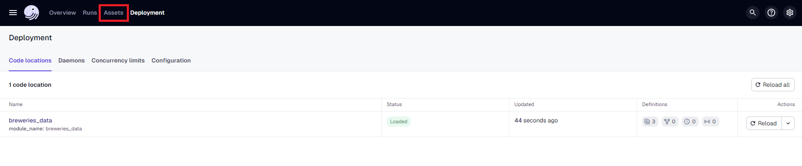
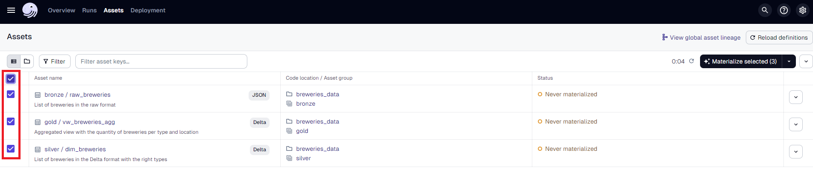
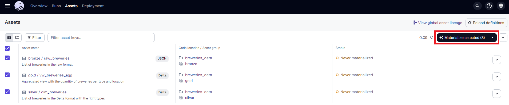

# Description
This project demonstrates a full ETL pipeline, getting data from an API and transforming it following the medallion architecture.

- Bronze Layer: Raw data in JSON format.
- Silver Layer: Cleansed and conformed data in Delta format.
- Gold Layer: Curated business-level views in Delta Format.

The source of the data is the [Open Brewery DB](https://openbrewerydb.org/), an API that makes available information about breweries, cideries, brewpubs, and bottleshops.

Assets* genereted by the pipeline:
- raw_breweries (bronze): Raw data from the API endpoint: https://api.openbrewerydb.org/v1/breweries.
- dim_breweries (silver): List of breweries in the Delta format with the right types.
- vw_breweries_agg (gold): Aggregated view with the quantity of breweries per type and country.

\* An asset is an object in persistent storage, such as a table, file, or persisted machine learning model. (Dagster Definition)


# Architeture
- Orchestration: Dagster
- ETL: Pandas
- Language: Python
- Storage: Delta Lake (Local)

Dagster was the tool chosen for this project due to its simplicity of implementation and development, as well as features that increase quality in a data enviroment, such as asset catalog, object dependency and io managers to standardize data input and output. ETL with Pandas was chosen by the same reasons plus the ingregration with Delta Lake library, which was used due to all the benefits of Lakehouse like Time Travel and ACID operations.

The main tradeoffs in this project/architeture are that Pandas is not the best option for work with big/medium workloads, the Dagster's deployment as service will have all the Dagster's components in the same machine including the jobs execution, so the environment will be less efficient as the number of pipelines grows, and the utilization of delta-rs (Delta Lake library) that dont have all the features of Delta library for Spark, just for compartion the Delta library is in the 3.2.0 version and the delta-rs in the 0.18.1 version.

Some solution/upgrades that may resolve the topics mentioned above are:
- Deploy Dagster with Docker/Kubernetes running components and jobs execution in different machine/containers.
- Optimization of ETL jobs using tools with a better performance on a single machine, as DuckDB.
- Using Dagster only as an orchestrator, running ETL Jobs with solutions like Spark or MDWs (Snowflake, Redshift, etc).


# Requirements

With Docker:
- Docker Engine = This project was tested using the version 26.1.4

Without Docker:
- Python = ">=3.10,<3.13"
- Python Libraries = Check the pyproject.toml file
- Poetry = This project was tested using the version 1.7.1

# How to Run (Docker)
1. Build the docker file.
```sh
docker build --no-cache -t dagster-breweries .
```
2. Run the docker image.
```sh
docker run -it --network=host dagster-breweries bash
```
2.1. If you want to check the files generated you can run the docker mounting a volume.
```sh
docker run -it --network=host -v /dagster_home/deltalake/ dagster-breweries bash
```
3. Dagster will be available at port 3000.
4. To run the jobs and generate the data just click on "Assets".

5. Select all assets (boxes).

6. Click "Materialize selected".

7. Now you can see details clicking on each asset.

# How to Run (Python)
1. Install the dependencies.
```sh
poetry install --only main
```
2. Start Dagster server.
```sh
# If you're using virtual environments don't forget to activate it first with 'poetry shell'
dagster dev
```
3. Set the 'STORAGE_PATH' variable in the .env file to be asset's location.
4. Dagster will be available at port 3000.
5. To run the jobs and generate the data just click on "Assets".

6. Select all assets (boxes).

7. Click "Materialize selected".

8. Now you can see details clicking on each asset.

# Refs
- [Poetry](https://python-poetry.org/)
- [Dagster (ETL)](https://dagster.io/)
- [Brewery DB](https://openbrewerydb.org/)
